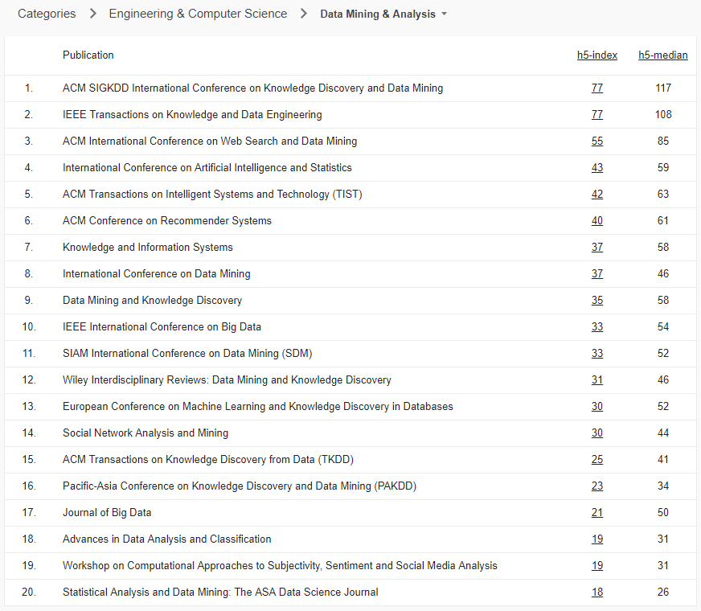

# Social Network Analysis Papers

 

<!--  -->

## Table of Contents

1. Social Network Analysis (Social Media Analysis)
2. Graph / Network Theory
3. Network Feature Extraction / Feature Engineering
4. Information Propagation / Diffusion / Cascades
5. Dynamic Network / Evolving Network
6. Network Inference / Link Prediction
7. Influential / Influence Maximization (Estimation, Limitation)
8. Community Structure / Strong & Weak Ties
9. Network Embedding / Graph Neural Network
10. Miscellaneous
    1. Anomaly Detection / Fake News Detection
    2. Motifs and Graphlets

<!-- 6. Anomaly Detection / Fake News Detection -->

<!--
Small World Phenomenon & Random Graph
Signed Network
Link Analysis & Web Search
Clustering / Community Detection
Info. Diffusion & Cascading
Influence Maximization
Power Law & Preferential Attachment
Link Prediction
 -->

<!--

-->

- **Digital Libraries**
  - [`ACM DL`]() [`Xplore`]() [`SpringerLink`]() [`arXiv`]() [`Cornell`]()
- **Badges**
  - [][0] [][0] [][0] [][0] [][0] [][0] [][0]

<!-- 

 -->

- **Conferences**

Graph Mining / Web Search

|        |       |      |      |     |
| ------ | ----- | ---- | ---- | --- |
| KDD    | WWW   | WSDM |      |     |
| ICDM   | ICDE  | CIKM | CSCW |     |
| ASONAM | ICWSM |      |      |     |

Representation Learning on Networks

|         |      |      |      |      |
| ------- | ---- | ---- | ---- | ---- |
| NeurIPS | ICLR | ICML | AAAI | CVPR |

### 1 Social Network Analysis (Social Media Analysis)

- Measuring User Influence in Twitter: The Million Follower Fallacy (ICWSM 2010) [`AAAI`](https://www.aaai.org/ocs/index.php/ICWSM/ICWSM10/index)
- What is Twitter, a Social Network or a News Media? (WWW 2010) [`ACM DL`](https://dl.acm.org/citation.cfm?id=1772751) [`PDF`](https://an.kaist.ac.kr/~haewoon/papers/2010-www-twitter.pdf)  
- Graphs over Time: Densification Laws, Shrinking Diameters and Possible Explanations (KDD 2005)
- Doodle Around the World: Online Scheduling Behavior Reflects Cultural Differences in Time Perception and Group Decision-Making (CSCW 2013)
- BotOrNot: A System to Evaluate Social Bots (WWW 2016) 
- Exploring Limits to Prediction in Complex Social Systems (WWW 2016)
- SNA: Characteristics of OSNs after a disaster (Information Management 2017)
- Ranking Users in SNs with Higher-Order Structures (AAAI 2018)

### 2 Graph / Network Theory

- Emergence of Scaling in Random Networks (SCIENCE 1999)
- On Power-Law Relationships of the Internet Topology (SIGCOMM 1999)
- Authoritative Sources in a Hyperlinked Environment (SODA 1998)
- Higher-Order Web Link Analysis Using Multilinear Algebra (ICDM 2005)

### 3. Network Feature Extraction / Feature Engineering

##### Motifs and Graphlets

- Network Motifs: Simple Building Blocks of Complex Networks (Science 2002) [`Science`](http://science.sciencemag.org/content/298/5594/824)
- Motifs in Temporal Networks (WSDM 2017) [`ACM DL`](https://dl.acm.org/citation.cfm?id=3018731)
- Biological network comparison using graphlet degree distribution (Bioinformatics 2007) 
- Graphlet-based Characterization of Directed Networks (Scientific Reports 2016)

### 4. Information Propagation / Diffusion / Cascades

##### Information Diffusion

- On the Bursty Evolution of Blogspace (WWW 2003)
- Information Diffusion Through Blogspace (WWW 2004) 
- Information Contagion: an Empirical Study of the Spread of News on Digg and Twitter Social Networks (AAAI 2010)
- The Role of Social Networks in Information Diffusion (WWW 2012)
- Structure and Dynamics of Information Pathways in Online Media (WSDM 2013) 
- Information Diffusion in OSNs: A Survey (SIGMOD 2013)
- Dynamic Propagation Rates: New Dimension to Viral Marketing in OSNs (ICDM 2017)

##### Information Cascades

- Can cascades be predicted? (WWW 2014)
- Do Cascades Recur? (WWW 2016)
- The Influence of Early Respondents: Information Cascade Effects in Online Event Scheduling (WWW 2017)
- Joint Modeling of Text and Networks for Cascade Prediction (ICWSM 2018)
- Do Diffusion Protocols Govern Cascade Growth? (ICWSM 2018)

### 5. Dynamic Network / Evolving Network

- .

### 6. Network Inference / Link Prediction

- Inferring Networks of Diffusion and Influence (KDD 2010)  #NetInf
- On the Convexity of Latent Social Network Inference (NIPS 2010)
- Uncovering the Temporal Dynamics of Diffusion Networks (ICML 2011)  #NetRate
- Efficient K-Nearest Neighbor Graph Construction for Generic Similarity Measures (WWW 2011) [`ACM DL`](https://dl.acm.org/citation.cfm?id=1963487)

### 7. Influential / Influence Maximization (Estimation, Limitation)

- Maximizing the Spread of Influence through a Social Network (KDD 2003) [`ACM DL`](https://dl.acm.org/citation.cfm?id=956769) 
- Finding Influentials Based on the Temporal Order of Information Adoption in Twitter (WWW 2010)
- Limiting the Spread of Misinformation in Social Networks (WWW 2011)
  - EIL: Eventual Influence Limitation
- Influence Maximization in Continuous Time Diffusion Networks (ICML 2012)
- Scalable Influence Estimation in Continuous-Time Diffusion Networks (NIPS 2013)  #ConTinEst
- Portfolio Optimization for Influence Spread (WWW 2017)
- Temporal Influence Blocking: Minimizing the Effect of Misinformation in Social Networks (ICDM 2017)
  - TIP: Temporal Influence Blocking
- Exact Computation of Influence Spread by Binary Decision Diagrams (WWW 2017)
- Active Opinion Maximization in Social Networks (KDD 2018)
- DebateNight: The Role and Influence of Socialbots on Twitter During the 1st 2016 U.S. Presidential Debate (ICWSM 2018) 

### 8. Community Structure / Strong & Weak Ties

- Statistical Properties of Community Structure in Large Social and Information Networks (WWW 2008)
- Structural Role Extraction & Mining in Large Graphs (KDD 2012) [`ACM DL`](https://dl.acm.org/citation.cfm?id=2339723)

### 9. Network Embedding / Graph Neural Network

- Representation Learning on Networks [(WWW 2018 Tutorial)](http://snap.stanford.edu/proj/embeddings-www/)

##### Network Embedding

- DeepWalk: Online Learning of Social Representations (KDD 2014)
- LINE: Large-scale Information Network Embedding (WWW 2015)
- A Survey on Network Embedding (AAAI 2018) 
- Scalable Temporal Latent Space Inference for Link Prediction in Dynamic Social Networks (TKDE 2016)
- Dynamic Network Embedding by Modeling Triadic Closure Process (AAAI 2018) 
  - DynamicTriad

##### Graph Neural Network / Graph Convolutional Network

- GNN
- Semi-Supervised Classification with Graph Convolutional Networks (ICLR 2017)
  - GCN
- Inductive representation learning on large graphs (NIPS 2017) [`ACM DL`](https://dl.acm.org/doi/10.5555/3294771.3294869)
  - GraphSAGE
- Graph Attention Networks (ICLR 2018) [`arXiv`](https://arxiv.org/abs/1710.10903v3) [`WEB`](https://petar-v.com/GAT/)
- Heterogeneous Graph Attention Network (WWW 2019) [`ACM DL`](https://dl.acm.org/doi/10.1145/3308558.3313562)

### 10. Miscellaneous

##### Anomaly Detection / Fake News Detection

> **_This section will be separated into a different repository - [TBA: Misinformation Detection Papers](https://github.com/jihochoi)_**
> .

- CatchSync: Catching Synchronized Behavior in Large Directed Graphs (KDD 2014)
- Fact-checking Effect on Viral Hoaxes: A Model of Misinformation Spread in Social Networks (WWW 2015)
- Hoaxy: A Platform for Tracking Online Misinformation (WWW 2016) Software #Hoaxy
- Fake News Detection on Social Media: A Data Mining Perspective (KDD 2017) 
- Fake News Detection on Social Media (KDD 2017)  
- Ranking Causal Anomalies by Modeling Local Propagations on Networked Systems (ICDM 2017)
- Tracing Fake News Footprints (WSDM 2018)
- Leveraging the Crowd to Detect and Reduce the spread of Fake News and Misinformation (WSDM 2018)
- The Hoaxy Misinformation and Fact-Checking Diffusion Network (ICWSM 2018) Software #Hoaxy
- FakeNewsTracker: A Tool for Fake News Collection, Detection, and Visualization (CMOT 2018) 
  (Computational and Mathematical Organization Theory)
- FakeNewsNet: A Data Repository with News Content, Social Context and Dynamic Information for Studying Fake News on Social Media (arXiv 2018) 

##### Motifs and Graphlets

- Network Motifs: Simple Building Blocks of Complex Networks (Science 2002) [`Science`](http://science.sciencemag.org/content/298/5594/824)
- Motifs in Temporal Networks (WSDM 2017) [`ACM DL`](https://dl.acm.org/citation.cfm?id=3018731)

### Contribution

- `Pull requests`

### References

- [Stanford Network Analysis Project (SANP)](http://snap.stanford.edu/) @ Stanford
- [Advanced Social Network Analysis](http://incpaper.snu.ac.kr/index.php/Sna2018spring) @ Seoul National University
- [CS224W Analysis of Networks](http://web.stanford.edu/class/cs224w/) @ Stanford
- [CS322 Social and Information Network Analysis](http://snap.stanford.edu/na09/) @ Stanford
- [Data Mining & Analysis - Google Scholar](https://scholar.google.es/citations?view_op=top_venues&hl=en&vq=eng_datamininganalysis)
- [Databases & Information Systems - Google Scholar](https://scholar.google.es/citations?view_op=top_venues&hl=en&vq=eng_databasesinformationsystems)

[0]: https://github.com/jihochoi
