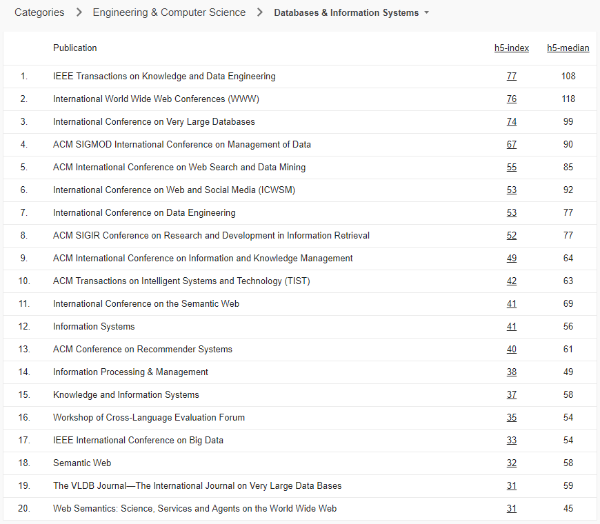

# Social Network Analysis Papers

[](https://github.com/jihochoi)
<!-- [](https://github.com/jihochoi) -->

## Table of Contents
1. Social Network Analysis (Social Media Analysis)
1.   
2. Information Diffusion / Propagation
3. Information Cascade
4. Network Inference
5. Influential / Influence Estimation / Maximization
6. Anomaly Detection / Fake News Detection
7. Network Embedding / Deep Learning


<!--


-->


- **Digital Libraries**
    - [```ACM DL```]() [```Xplore```]() [```SpringerLink```]() [```arXiv```]() [```Cornell```]()
- **Badges**
    - []((https://github.com/jihochoi)
[](https://github.com/jihochoi)
[](https://github.com/jihochoi)
[](https://github.com/jihochoi)
[]((https://github.com/jihochoi)
[](https://github.com/jihochoi)
[](https://github.com/jihochoi)

<!-- [](https://github.com/jihochoi)
[](https://github.com/jihochoi)
[](https://github.com/jihochoi) -->

- **Conferences**

|      |      |      |      |       |
| ---- | ---- | ---- | ---- |-------|
| KDD  | WWW  | WSDM | AAAI | ICML  |
| ICDM | ICDE | CIKM | CSCW | ICWSM |


### 1. Social Network Analysis (Social Media Analysis)
- What is Twitter, a Social Network or a News Media? (WWW 2010) [```ACM DL```](https://dl.acm.org/citation.cfm?id=1772751) [```PDF```](https://an.kaist.ac.kr/~haewoon/papers/2010-www-twitter.pdf) []((https://github.com/jihochoi)
[](https://github.com/jihochoi)
- Doodle Around the World: Online Scheduling Behavior Reflects Cultural Differences in Time Perception and Group Decision-Making (CSCW 2013)
- BotOrNot: A System to Evaluate Social Bots (WWW 2016) [](https://github.com/jihochoi)
- Exploring Limits to Prediction in Complex Social Systems (WWW 2016)
- SNA: Characteristics of OSNs after a disaster (Information Management 2017)
- Ranking Users in SNs with Higher-Order Structures (AAAI 2018)


### 2. Information Diffusion / Propagation
- On the Bursty Evolution of Blogspace (WWW 2003)
- Information Diffusion Through Blogspace (WWW 2004) []((https://github.com/jihochoi)
- Information Contagion: an Empirical Study of the Spread of News on Digg and Twitter Social Networks (AAAI 2010)
- The Role of Social Networks in Information Diffusion (WWW 2012)
- Structure and Dynamics of Information Pathways in Online Media (WSDM 2013) []((https://github.com/jihochoi)
- Information Diffusion in OSNs: A Survey (SIGMOD 2013)
- Dynamic Propagation Rates: New Dimension to Viral Marketing in OSNs (ICDM 2017)


### 3. Information Cascades
- Can cascades be predicted? (WWW 2014)
- Do Cascades Recur? (WWW 2016)
- The Influence of Early Respondents: Information Cascade Effects in Online Event Scheduling (WWW 2017)
- Joint Modeling of Text and Networks for Cascade Prediction (ICWSM 2018)
- Do Diffusion Protocols Govern Cascade Growth? (ICWSM 2018)


### 4. Link Prediction / Network Inference
- Inferring Networks of Diffusion and Influence (KDD 2010) []((https://github.com/jihochoi) #NetInf
- On the Convexity of Latent Social Network Inference (NIPS 2010)
- Uncovering the Temporal Dynamics of Diffusion Networks (ICML 2011) []((https://github.com/jihochoi) #NetRate


### 5. Influential / Influence Maximization (Estimation, Limitation)
- Maximizing the Spread of Influence through a Social Network (KDD 2003) [```ACM DL```](https://dl.acm.org/citation.cfm?id=956769) []((https://github.com/jihochoi)
- Finding Influentials Based on the Temporal Order of Information Adoption in Twitter (WWW 2010)
- Limiting the Spread of Misinformation in Social Networks (WWW 2011)
    - EIL: Eventual Influence Limitation
- Influence Maximization in Continuous Time Diffusion Networks (ICML 2012)
- Scalable Influence Estimation in Continuous-Time Diffusion Networks (NIPS 2013) []((https://github.com/jihochoi) #ConTinEst
- Portfolio Optimization for Influence Spread (WWW 2017)
- Temporal Influence Blocking: Minimizing the Effect of Misinformation in Social Networks (ICDM 2017)
    - TIP: Temporal Influence Blocking
- Exact Computation of Influence Spread by Binary Decision Diagrams (WWW 2017)
- Active Opinion Maximization in Social Networks (KDD 2018)
- DebateNight: The Role and Influence of Socialbots on Twitter During the 1st 2016 U.S. Presidential Debate (ICWSM 2018) [](https://github.com/jihochoi)


### 6. Anomaly Detection / Fake News Detection
- Fact-checking Effect on Viral Hoaxes: A Model of Misinformation Spread in Social Networks (WWW 2015)
- Fake News Detection on Social Media: A Data Mining Perspective (KDD 2017) [](https://github.com/jihochoi)
- Hoaxy: A Platform for Tracking Online Misinformation (WWW 2016) Software #Hoaxy
- Fake News Detection on Social Media (SIGKDD 2017) [](https://github.com/jihochoi) [](https://github.com/jihochoi)
- Tracing Fake News Footprints (WSDM 2018)
- Leveraging the Crowd to Detect and Reduce the spread of Fake News and Misinformation (WSDM 2018)
- The Hoaxy Misinformation and Fact-Checking Diffusion Network (ICWSM 2018) Software #Hoaxy
- FakeNewsTracker: A Tool for Fake News Collection, Detection, and Visualization (CMOT 2018) [](https://github.com/jihochoi)
(Computational and Mathematical Organization Theory)
- FakeNewsNet: A Data Repository with News Content, Social Context and Dynamic Information for Studying Fake News on Social Media (arXiv 2018) [](https://github.com/jihochoi)
- CatchSync: Catching Synchronized Behavior in Large Directed Graphs (KDD 2014)
- Ranking Causal Anomalies by Modeling Local Propagations on Networked Systems (ICDM 2017)


### 7. Network Embedding / Deep Learning

- DeepWalk: Online Learning of Social Representations (KDD 2014)
- LINE: Large-scale Information Network Embedding (WWW 2015)
- A Survey on Network Embedding (AAAI 2018) [](https://github.com/jihochoi)


### References
- [Stanford Network Analysis Project (SANP)](http://snap.stanford.edu/) @ Stanford
- [Advanced Social Network Analysis](http://incpaper.snu.ac.kr/index.php/Sna2018spring) @ Seoul National University
- [CS322 (Social and Information) Network Analysis](http://snap.stanford.edu/na09/) @ Stanford
- [Data Mining & Analysis - Google Scholar](https://scholar.google.es/citations?view_op=top_venues&hl=en&vq=eng_datamininganalysis)
- [Databases & Information Systems](https://scholar.google.es/citations?view_op=top_venues&hl=en&vq=eng_databasesinformationsystems)
